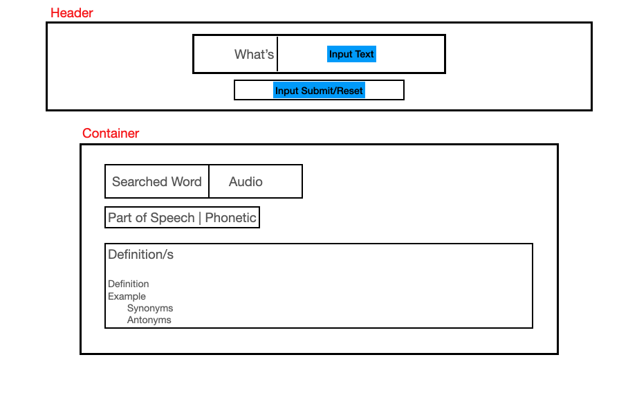

# What's that word?
"What's that word?" is a website that allows users to search for words they might not know of the meaning. It's basically an online dictionary at gives you examples, synonyms and antonyms.

## Screenshot

Planned Framework:


### Technologies Used
* HTML5
* CSS3
* Javascript
* jQuery
* Google Fonts
* Dictionary API: https://dictionaryapi.dev/

#### Deployed Site
https://giangela01.github.io/Whats-that-word/

#### Future Enhancements
* Adapt Mobile First approach (add Media Queries) 
* Ability to go over past searched words
* Added Section of "Word of the Day?

#### Contributing
Pulls are always welcome. Any contributions and fixes you make are greatly appreciated. Thank you in advance!

#### Ongoing Issues
* When entering a another word without clicking "Clear Search", removes container css.
* Synonyms and Antonyms data not formatted properly and ternary operator added text if condition is true still appear even if condition is false.
```
let defList = defA.map = (`<dl><lh>:${defA.definition}</lh>
                                <dt><em>${defA.example ? 'Example: ' + defA.example : ""}</em></dt>
                                <dd>${defA.synonyms ? '<u>Synonyms</u>: ' + defA.synonyms : ""}</dd>
                                <dd>${defA.antonyms ? '<u>Antonyms</u>: ' + defA.antonyms : ""}</dd>
                            </dl>`);
```


